# MDMPatcher Enhanced

### ⚠️ **Legal & Technical Disclaimer**  
> This project is intended strictly for **educational, diagnostic, and personal device recovery use only**.  
> It must **only** be used on iOS devices that the user **legally owns** and has the right to modify.  
>
> **MDMPatcher Enhanced does not jailbreak, exploit or modify firmware**. It relies entirely on public interfaces (AFC, plist editing, USB restore flows).  
>
> The tool targets situations like second-hand iOS devices where MDM was not removed correctly.  
> **Using this software on managed, corporate, or institutional devices without permission is prohibited and may be illegal.**

## Table of Contents

- [⚠️ Legal & Technical Disclaimer](#️-legal--technical-disclaimer)
- [Overview](#overview)
  - [Application Preview](#application-preview)
- [Changes from the Original Repository](#changes-from-the-original-repository)
- [Requirements](#requirements)
- [Instructions](#instructions)
- [Typical Issues](#typical-issues)
  - [Problem: Unable to Open MDMPatcher Enhanced](#problem-unable-to-open-mdmpatcher-enhanced)
  - [Problem: App Instantly Crashes on Launch](#problem-app-instantly-crashes-on-launch)
  - [Problem: Error Occurs While Patching](#problem-error-occurs-while-patching)
- [Final Thoughts](#final-thoughts)
- [🧠 Internals & Architecture](#-internals--architecture)
  - [System Diagram](#system-diagram)
  - [Core Components](#core-components)
  - [Technical Execution Flow](#technical-execution-flow)
    - [Phase 1: Application Initialization](#phase-1-application-initialization)
    - [Phase 2: Device Discovery and Validation](#phase-2-device-discovery-and-validation)
    - [Phase 3: Template Preparation and Decryption](#phase-3-template-preparation-and-decryption)
    - [Phase 4: Backup Customization](#phase-4-backup-customization)
    - [Phase 5: Backup Restoration](#phase-5-backup-restoration)
    - [Phase 6: Finalization](#phase-6-finalization)
    - [Error Handling Flow](#error-handling-flow)
- [Software Dependencies](#software-dependencies)
  - [Major Software Dependencies](#major-software-dependencies)
  - [Custom Static Libraries](#custom-static-libraries)
  - [Dynamic Libraries (Runtime)](#dynamic-libraries-runtime)
  - [System Frameworks (macos)](#system-frameworks-macos)
  - [Development Dependencies](#development-dependencies)
  - [Build System Dependencies](#build-system-dependencies)
  - [Runtime Environment Requirements](#runtime-environment-requirements)
  - [Third-Party Integrations](#third-party-integrations)
  - [Security Dependencies](#security-dependencies)
  - [Optional Dependencies](#optional-dependencies)

## Overview

MDMPatcher Enhanced is a macOS tool that helps remove or bypass Mobile Device Management (MDM) profiles from supervised iPhones and iPads. It is designed for scenarios where users need to regain full control over a personally owned device — for example after second-hand purchases or faulty deregistration.

No jailbreak is required. No low-level kernel or firmware modifications are performed.

### Application Preview

## Changes from the Original Repository
- **Improved documentation**
- **Bug fixes**
- **Troubleshooting section added**
- **Clarity improvements for restore & patching**

## Requirements
- macOS 10.13+ (Intel or Apple Silicon)
- iOS 15 to 18.5+
- iPhone 5s to iPhone 16
- All current iPads
- IPSW file for your device (from [ipsw.me](https://ipsw.me))

## Instructions
- Download the correct IPSW file for your device from [ipsw.me](https://ipsw.me).
  - To find the correct IPSW file for your iOS device:
    - Look up the model number on the back of your device (e.g., A1567).
    - Match the model number with the device name using a website like [The iPhone Wiki](https://www.theiphonewiki.com/wiki/Models). For example, A1567 corresponds to the iPad Air 2.
    - **Choose between Cellular and Wi-Fi versions:** If your device has a SIM card slot, download the Cellular IPSW; otherwise, download the Wi-Fi only version.
- Put your iOS device into recovery mode.
  - **For iPads without a Home button:** Press and hold the Top button while connecting it to your computer. Keep holding until the recovery mode screen appears.
  - **For iPads with a Home button:** Hold the Home button while connecting it to your computer. Keep holding until the recovery mode screen appears.
  - **For iPhones with Face ID or iPhone 8 and later:** Press and hold the Side Button while connecting it to your computer. Keep holding the button until the recovery mode screen appears.
  - **For iPhone 7 and 7 Plus:** Hold the Volume Down button and connect it to your computer.
  - **For iPhone 6s and earlier:** Hold the Home Button while connecting it to your computer.
- Once in recovery mode, a message will appear on your computer asking if you want to update or restore the device. **Hold the OPTION key** on your keyboard, then click either **Update** or **Restore**. This will allow you to choose the IPSW file you downloaded for your device.
- After restoration, follow initial setup **until you reach the Wi-Fi selection** screen. **Do NOT connect to ANY network!**
- Open the MDMPatcher app on your Mac.
- Disable SIP if the app won’t open (for M1 Macs: use csrutil disable in recovery mode terminal).
  - Read more at [developer.apple.com](https://developer.apple.com/documentation/security/disabling-and-enabling-system-integrity-protection)
- **Important:** Before opening the MDMPatcher app, open Finder, click on your iPad, and wait for it to finish activating (it will show "Get Started"). You may need to unplug and reconnect the cable if you encounter issues.
- When your device info shows in MDMPatcher, click "PATCH" to complete the process.
- After reboot, follow the remaining setup instructions on the device.

## Typical Issues
### Problem: Unable to Open MDMPatcher Enhanced
You might encounter a security warning preventing the app from opening, as shown below.
 

 
**Solution:**
1. Right-click the app and select Open.
2. If the app still won’t open, go to **System Settings > Privacy & Security** and under the Security section, allow the app by clicking Open Anyway.
 

---

### Problem: App Instantly Crashes on Launch
If the MDMPatcher Enhanced app crashes immediately upon opening, this is likely due to macOS's System Integrity Protection (SIP) blocking the app.

**Solution:**
1. Boot your Mac into Recovery Mode.
2. Open Terminal in Recovery Mode.
3. Type `csrutil disable` and press Enter.
4. Restart your Mac, then try opening the app again.

Be cautious when disabling SIP, as it reduces system security. Read more about it at [developer.apple.com](https://developer.apple.com/documentation/security/disabling-and-enabling-system-integrity-protection)

---

### Problem: Error Occurs While Patching
If an error occurs during the patching process, it’s often because the device hasn’t fully completed activation.

**Solution:**
1. Before opening MDMPatcher, open Finder on your Mac.
2. Click on your device in the Finder sidebar.
3. Wait for the device to fully activate (it will display "Get Started" when ready).
4. Then, proceed with the patching.

This should resolve most patching errors.

## Final Thoughts
This project aims to support lawful restoration of iOS/iPadOS devices that were improperly decommissioned. It provides a lightweight, GUI-driven alternative for tech-savvy users who understand the risks and legal limitations involved.

## 🧠 Internals & Architecture

### System Diagram

```mermaid
flowchart TD
    %% User Interface Layer
    A["🖥️ macOS Application Launch"] --> B["📱 USB Device Detection"]
    
    %% USB Detection System
    B --> C{"🔍 iOS Device Connected?"}
    C -->|No| D["⏳ Monitor USB Events"]
    D --> C
    C -->|Yes| E["✅ Device Validation"]
    
    %% Device Validation
    E --> F{"📋 Product ID Check"}
    F -->|4776/4779| G["🔗 Establish Connection"]
    F -->|Other| D
    
    %% Device Communication Layer
    G --> H["📡 libimobiledevice Init"]
    H --> I["🔐 Lockdown Protocol"]
    I --> J["📊 Device Info Extraction"]
    
    %% Information Gathering
    J --> K["🆔 UDID Retrieval"]
    J --> L["📱 Device Model"]
    J --> M["🔢 Serial Number"]
    J --> N["📶 IMEI (if available)"]
    J --> O["🏗️ Build Version"]
    
    %% Data Processing
    K --> P["📋 Device Data Validation"]
    L --> P
    M --> P
    N --> P
    O --> P
    
    P --> Q{"✅ All Data Retrieved?"}
    Q -->|No| R["❌ Error Display"]
    Q -->|Yes| S["🎯 Patch Button Enabled"]
    
    %% User Interaction
    S --> T{"👆 User Clicks Patch?"}
    T -->|No| U["⏸️ Wait for User"]
    U --> T
    T -->|Yes| V["🚀 Start Patching Process"]
    
    %% Patching Process
    V --> W["📁 Create Temp Directory"]
    W --> X["🔓 Decrypt Template Files"]
    
    %% Template Processing
    X --> Y["📄 extension1.pdf Decryption"]
    X --> Z["📄 extension2.pdf Decryption"]
    X --> AA["📦 libiMobileeDevice.dylib Decryption"]
    
    %% Obfuscation Removal
    Y --> BB["🔄 Byte Swapping"]
    Z --> BB
    AA --> BB
    
    BB --> CC["🔑 Password Computation"]
    CC --> DD["🛡️ RNCryptor Decryption"]
    
    %% File Customization
    DD --> EE["✏️ Info.plist Customization"]
    DD --> FF["✏️ Manifest.plist Customization"]
    DD --> GG["📦 Backup Archive Extraction"]
    
    %% Device-Specific Patching
    EE --> HH["🔧 Replace Build Version"]
    EE --> II["🔧 Replace Product Type"]
    EE --> JJ["🔧 Replace Serial Number"]
    EE --> KK["🔧 Replace UDID"]
    EE --> LL["🔧 Handle IMEI (if present)"]
    
    FF --> MM["📋 Manifest Updates"]
    GG --> NN["📁 MDMB Directory Creation"]
    
    %% File Assembly
    HH --> OO["💾 Write Info.plist"]
    II --> OO
    JJ --> OO
    KK --> OO
    LL --> OO
    MM --> PP["💾 Write Manifest.plist"]
    NN --> QQ["📦 Extract Backup Files"]
    
    %% Backup Restoration
    OO --> RR["🔄 Backup Structure Ready"]
    PP --> RR
    QQ --> RR
    
    RR --> SS["📲 idevicebackup2 Init"]
    SS --> TT["🔗 Device Connection Check"]
    TT --> UU{"📱 Device Ready?"}
    UU -->|No| VV["❌ Connection Error"]
    UU -->|Yes| WW["📤 Start Backup Restoration"]
    
    %% Restoration Process
    WW --> XX["📋 Backup Validation"]
    XX --> YY["📁 File Transfer"]
    YY --> ZZ["🗃️ Database Updates"]
    ZZ --> AAA["🔄 Device Reboot"]
    
    %% Final Steps
    AAA --> BBB{"✅ Restoration Success?"}
    BBB -->|No| CCC["❌ Restoration Error"]
    BBB -->|Yes| DDD["🎉 Success Message"]
    
    %% Cleanup
    DDD --> EEE["🧹 Cleanup Temp Files"]
    CCC --> EEE
    VV --> EEE
    R --> EEE
    
    EEE --> FFF["🔄 Reset UI State"]
    FFF --> S
    
    %% Error Handling Paths
    R --> GGG["📝 Log Error Details"]
    VV --> GGG
    CCC --> GGG
    GGG --> HHH["👤 User Notification"]
    HHH --> EEE
    
    %% Styling
    classDef uiLayer fill:#e1f5fe,stroke:#01579b,stroke-width:2px
    classDef deviceLayer fill:#f3e5f5,stroke:#4a148c,stroke-width:2px
    classDef processLayer fill:#e8f5e8,stroke:#1b5e20,stroke-width:2px
    classDef errorLayer fill:#ffebee,stroke:#b71c1c,stroke-width:2px
    classDef successLayer fill:#e0f2f1,stroke:#004d40,stroke-width:2px
    
    class A,S,T,U,FFF uiLayer
    class B,C,D,E,F,G,H,I,J,K,L,M,N,O,P,Q,TT,UU deviceLayer
    class V,W,X,Y,Z,AA,BB,CC,DD,EE,FF,GG,HH,II,JJ,KK,LL,MM,NN,OO,PP,QQ,RR,SS,WW,XX,YY,ZZ,AAA,BBB,EEE processLayer
    class R,VV,CCC,GGG,HHH errorLayer
    class DDD successLayer
```

### Core Components

| Component | Type | File | Description | Dependencies |
|-----------|------|------|-------------|-------------|
| **Main Application** | Swift | ViewController.swift | Primary UI controller handling device interaction and patching workflow | IOKit, libimobiledevice |
| **USB Detection System** | Swift | USBDetection.swift | Real-time USB device monitoring and iOS device identification | IOKit Framework |
| **Device Information** | Swift | iDeviceInfoFunctions.swift | Device property extraction and parsing structures | PropertyListDecoder |
| **C Bridge Functions** | C Header | libidevicefunctions.h | Function declarations for Swift-C interoperability | libimobiledevice |
| **Device Communication** | C | libidevicefunctions.c | Low-level device communication and callback handling | libimobiledevice, libirecovery |
| **Backup Restoration** | C Header | idevicebackup2.h | Backup restoration function declarations | - |
| **Backup Engine** | C | idevicebackup2.c | Complete backup/restore implementation with command-line interface | libimobiledevice suite |
| **UI Extensions** | Swift | ExtensionsShit.swift | NSAlert extensions for user notifications | AppKit |
| **App Delegate** | Swift | AppDelegate.swift | Application lifecycle management | Cocoa |
| **Bridging Header** | Objective-C | MDMPatcher-Bridging-Header.h | Swift-C interoperability bridge | IOKit, Custom C headers |

### Technical Execution Flow
#### Phase 1: Application Initialization
1. **macOS Application Launch**
   - Initialize Cocoa application framework
   - Load main storyboard and UI components
   - Set up application delegate and view controller
   - Initialize USB monitoring subsystem

2. **USB Detection System Activation**
   - Register IOKit notifications for USB device events
   - Monitor for iOS device connection (Product IDs: 4776, 4779)
   - Establish device enumeration callbacks
   - Initialize libimobiledevice communication stack

#### Phase 2: Device Discovery and Validation
3. **iOS Device Detection**
   - Detect USB device insertion events
   - Validate device product ID against known iOS devices
   - Establish initial USB communication channel
   - Verify device accessibility and responsiveness

4. **Device Communication Establishment**
   - Initialize libimobiledevice session
   - Establish lockdown protocol connection
   - Authenticate with device using pairing records
   - Set up secure communication channel

5. **Device Information Extraction**
   - Query device for UDID (Unique Device Identifier)
   - Retrieve device model and product type
   - Extract serial number and hardware identifiers
   - Obtain build version and firmware information
   - Attempt IMEI retrieval (if available on device)

#### Phase 3: Template Preparation and Decryption
6. **Resource Decryption Process**
   - Load encrypted template files from application bundle
   - Generate device-specific decryption passwords
   - Perform byte-swapping operations to deobfuscate data
   - Decrypt templates using RNCryptor with computed keys

7. **Template File Processing**
   - **extension1.pdf**: Decrypt to obtain Info.plist template
   - **extension2.pdf**: Decrypt to obtain Manifest.plist template
   - **libiMobileeDevice.dylib**: Decrypt and extract backup archive
   - Validate decrypted content integrity

#### Phase 4: Backup Customization
8. **Device-Specific Template Injection**
   - Replace placeholder values in Info.plist template:
     - `{{BuildVersion}}` → Device build version
     - `{{ProductType}}` → Device product identifier
     - `{{SerialNumber}}` → Device serial number
     - `{{UDID}}` → Device unique identifier
     - `{{IMEI}}` → Device IMEI (if present)

9. **Manifest File Generation**
   - Customize Manifest.plist with device-specific data
   - Update file hashes and metadata
   - Configure backup structure and file relationships
   - Set appropriate timestamps and version information

10. **Backup Archive Assembly**
    - Create temporary directory structure
    - Extract base backup files from decrypted archive
    - Place customized Info.plist and Manifest.plist
    - Organize files according to iOS backup format
    - Generate MDMB (Mobile Device Management Bypass) directory

#### Phase 5: Backup Restoration
11. **idevicebackup2 Initialization**
    - Initialize backup restoration engine
    - Verify device connection and readiness
    - Prepare backup validation and transfer protocols
    - Set up progress monitoring and error handling

12. **Backup Transfer Process**
    - Validate backup structure and file integrity
    - Begin file-by-file transfer to device
    - Update device backup database entries
    - Monitor transfer progress and handle errors

13. **Device Database Updates**
    - Modify device backup manifest database
    - Update file system metadata
    - Configure MDM bypass entries
    - Ensure backup consistency and integrity

#### Phase 6: Finalization
14. **Device Reboot and Verification**
    - Trigger device reboot to apply changes
    - Monitor device restart process
    - Verify successful backup restoration
    - Confirm MDM bypass activation

15. **Cleanup and Status Reporting**
    - Remove temporary files and directories
    - Clear sensitive data from memory
    - Display success/failure status to user
    - Reset UI state for potential subsequent operations

#### Error Handling Flow
16. **Comprehensive Error Management**
    - Device connection failures → Retry with timeout
    - Decryption errors → Validate templates and passwords
    - Backup transfer failures → Resume from last checkpoint
    - Device communication errors → Re-establish connection
    - Critical failures → Clean up and report to user
   
### Software Dependencies

#### Major Software Dependencies

| Dependency | Version | Type | Purpose | License | Source |
|------------|---------|------|---------|---------|--------|
| **libimobiledevice** | 1.0+ | Static Library | Core iOS device communication protocol | LGPL-2.1 | libimobiledevice.org |
| **libirecovery** | Latest | Dynamic Library | Recovery mode device interaction and firmware manipulation | LGPL-2.1 | libimobiledevice.org |
| **libusbmuxd** | Latest | Dynamic Library | USB multiplexing daemon interface for device communication | LGPL-2.1 | libimobiledevice.org |
| **libplist** | Latest | Dynamic Library | Property list parsing and generation for iOS configuration files | LGPL-2.1 | libimobiledevice.org |
| **libssl** | Latest | Dynamic Library | SSL/TLS encryption for secure device communication | OpenSSL | OpenSSL Project |
| **libcrypto** | Latest | Dynamic Library | Cryptographic operations and encryption algorithms | OpenSSL | OpenSSL Project |
| **libzip** | Latest | Dynamic Library | Archive compression and decompression for backup handling | BSD-3-Clause | libzip.org |
| **libcurl** | Latest | Dynamic Library | HTTP/HTTPS networking and data transfer | MIT-style | curl.se |
| **libfragmentzip** | Latest | Dynamic Library | Partial ZIP file operations for selective extraction | Custom | tihmstar/libfragmentzip |
| **RNCryptor** | Latest | Framework | Data encryption and decryption with AES | MIT | RNCryptor/RNCryptor |
| **ZIPFoundation** | Latest | Framework | Swift ZIP archive handling and manipulation | MIT | weichsel/ZIPFoundation |

#### Custom Static Libraries

| Library | Purpose | Integration |
|---------|---------|-------------|
| **libcbpatcher.a** | Custom bootchain patching for device modification | Compiled into application |
| **libcbpatcher-old.a** | Legacy bootchain patching support | Fallback implementation |
| **libiboot32patcher.a** | 32-bit iBoot patching for older devices | Device-specific patching |
| **libideviceactivation-1.0.a** | Device activation handling (static) | Activation bypass |
| **libidevicerestore.a** | Device restore operations | Backup restoration |
| **libidevicerestore-old.a** | Legacy restore operations | Compatibility support |
| **libxpwntool.a** | Firmware manipulation and patching | Low-level device access |
| **libxpwntool-old.a** | Legacy firmware tools | Backward compatibility |

#### Dynamic Libraries (Runtime)

| Library | Runtime Purpose | Loading Method |
|---------|----------------|----------------|
| **libideviceactivation-1.0.2.dylib** | Device activation handling | Dynamic linking |
| **libirecovery.dylib** | Recovery mode operations | Runtime loading |
| **libplist.dylib** | Property list operations | Dynamic linking |
| **libssl.dylib** | SSL/TLS operations | System library |
| **libcrypto.dylib** | Cryptographic functions | System library |
| **libzip.dylib** | ZIP operations | Dynamic linking |
| **libcurl.dylib** | Network operations | System library |
| **libfragmentzip.dylib** | Partial ZIP extraction | Dynamic linking |
| **libusbmuxd.dylib** | USB device communication | Dynamic linking |

#### System Frameworks (macOS)

| Framework | Purpose | Usage |
|-----------|---------|-------|
| **IOKit** | Hardware device interaction and USB communication | USB device detection and management |
| **Cocoa** | macOS application framework | User interface and application lifecycle |
| **AppKit** | User interface components | UI elements and user notifications |
| **Foundation** | Core data types and utilities | String manipulation, data handling |
| **Security** | Cryptographic operations and keychain access | Secure data storage and encryption |
| **CoreFoundation** | Low-level system services | Memory management and data structures |

#### Development Dependencies

| Tool/Framework | Purpose | Usage Context |
|----------------|---------|---------------|
| **Xcode** | Integrated development environment | Project building and debugging |
| **Swift** | Primary programming language | Application logic and UI |
| **Objective-C** | Bridging language | C library integration |
| **C/C++** | Low-level system programming | Device communication and patching |
| **Git** | Version control system | Source code management |

#### Build System Dependencies

| Component | Purpose | Configuration |
|-----------|---------|---------------|
| **Xcode Build System** | Project compilation and linking | project.pbxproj configuration |
| **Clang/LLVM** | Compiler toolchain | Swift and C/C++ compilation |
| **ld** | Linker | Static and dynamic library linking |
| **codesign** | Code signing | Application signing and entitlements |
| **pkgutil** | Package management | Dependency resolution |

#### Runtime Environment Requirements

| Requirement | Version | Purpose |
|-------------|---------|----------|
| **macOS** | 10.15+ | Host operating system |
| **Xcode Command Line Tools** | Latest | Development tools and libraries |
| **USB Support** | Native | Device communication |
| **Network Access** | Optional | Device validation and updates |
| **Administrator Privileges** | Required | System-level device access |

#### Third-Party Integrations

| Integration | Purpose | Implementation |
|-------------|---------|----------------|
| **libimobiledevice Suite** | Complete iOS device interaction | Core functionality |
| **OpenSSL** | Cryptographic operations | Security and encryption |
| **zlib** | Data compression | Backup file handling |
| **libusb** | USB device communication | Low-level device access |

#### Security Dependencies

| Component | Security Purpose | Implementation |
|-----------|------------------|----------------|
| **Code Signing** | Application integrity verification | Xcode signing process |
| **Entitlements** | System permission management | MDMPatcher.entitlements |
| **Keychain Services** | Secure credential storage | Device pairing records |
| **Sandboxing** | Application isolation | macOS security model |

#### Optional Dependencies

| Dependency | Purpose | Fallback Behavior |
|------------|---------|-------------------|
| **Network Connectivity** | Device validation and updates | Offline mode with limited functionality |
| **iTunes/Music App** | Device driver installation | Manual driver installation required |
| **Xcode** | Advanced debugging and development | Runtime-only operation possible |
